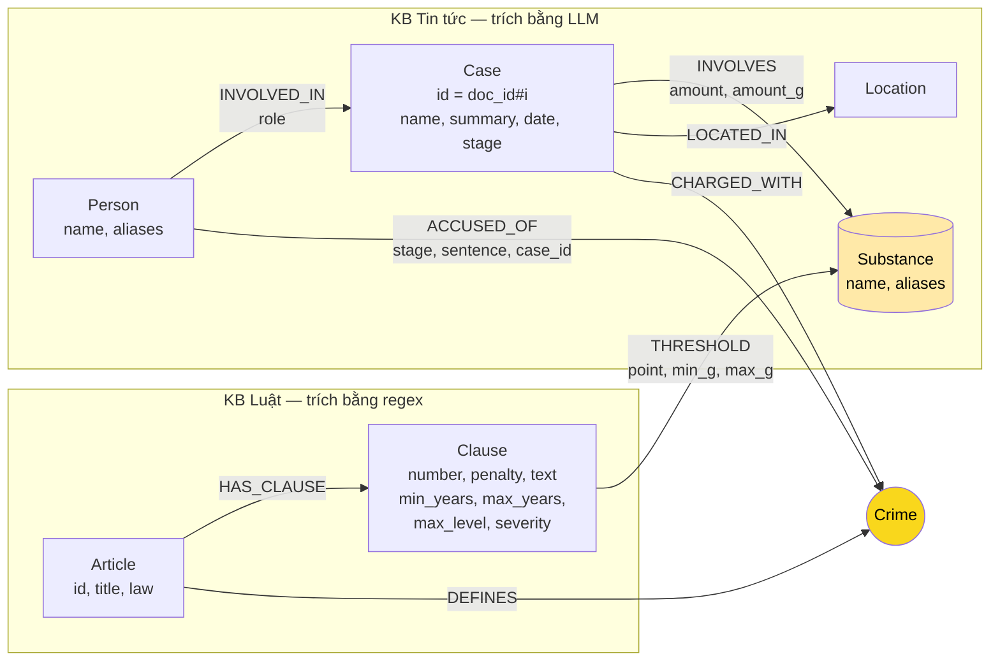

# Thiết kế Ontology — Day 19

**Họ tên:** Trần Nhật Minh  **MSSV:** 2A202602483

**Lựa chọn** (đánh dấu một):
- [ ] Dùng ontology gợi ý (có thể chỉnh nhỏ)
- [x] Tự thiết kế (xét bonus +15, xem `SUBMISSION.md`)

> Hướng dẫn: `LAB_GUIDE.md` Bước 2. Dùng ontology gợi ý thì vẫn phải điền đủ các mục dưới đây bằng lời của bạn.

## 1. Sơ đồ

Node cầu nối chính là `Crime` (vàng). `Substance` là cầu nối phụ: hai KB cùng nhắc tới chất, và ngưỡng khối lượng trên cạnh `THRESHOLD` dùng để chọn đúng khoản luật.

## 2. Entity types (node labels)

| Label | Ý nghĩa | Khóa định danh (`MERGE` theo) | Properties | Lấy từ KB nào | Trích bằng (regex / LLM / khác) |
| --- | --- | --- | --- | --- | --- |
| `Article` | Một Điều luật | `id` (vd. `"Điều 251 BLHS"`) | `title`, `law`, `doc_id` | Luật | metadata của file |
| `Clause` | Một khoản trong Điều | `id` (vd. `"Điều 251 BLHS khoản 4"`) | `number`, `penalty` (chuỗi gốc), `text`, `min_years`, `max_years`, `max_level` (`tù` / `chung thân` / `tử hình` / rỗng), `severity` (số để sắp xếp độ nặng), `doc_id` | Luật | regex |
| `Crime` | Tội danh (**cầu nối**) | `name` đã chuẩn hóa (vd. `"mua bán trái phép chất ma túy"`) | — | Luật (tiêu đề Điều); tin trỏ tới qua `link_entity` | regex + `normalize_crime` |
| `Substance` | Chất ma túy (**cầu nối phụ**) | `name` chuẩn (vd. `"Methamphetamine"`); chất không có trong danh sách giữ tên riêng (vd. `"etomidate"`); "ma túy" chung chung bị bỏ | `aliases` (tên báo hay dùng: "ma túy đá"…) | Cả hai | regex (luật); LLM + bảng đồng nghĩa + `link_entity` (tin) |
| `Case` | Một vụ việc trong một bài báo | `id` = `"<doc_id>#<thứ tự vụ trong bài>"` | `name`, `summary`, `date`, `stage` (giai đoạn tố tụng mới nhất bài nhắc tới), `doc_id`, `source_title` | Tin | LLM |
| `Person` | Người liên quan đến vụ | `name` (đã gọn khoảng trắng) | `aliases` (biệt danh, vd. "Hoàng Nato") | Tin | LLM |
| `Location` | Tỉnh/thành nơi xảy ra vụ | `name` | — | Tin | LLM |

## 3. Relationships

| Type | Từ → Đến | Properties trên cạnh | Ý nghĩa |
| --- | --- | --- | --- |
| `DEFINES` | `Article` → `Crime` | — | Điều luật quy định tội danh này |
| `HAS_CLAUSE` | `Article` → `Clause` | — | Điều gồm các khoản |
| `THRESHOLD` | `Clause` → `Substance` | `point` (điểm a/b/…), `min_g`, `max_g` (gam; `null` = "trở lên") | Khoản áp dụng khi khối lượng chất nằm trong `[min_g, max_g)` |
| `CHARGED_WITH` | `Case` → `Crime` | — | Vụ việc liên quan tội danh này (hợp của tội danh mọi người trong vụ) |
| `INVOLVES` | `Case` → `Substance` | `amount` (chuỗi gốc), `amount_g` (số, quy về gam; `null` nếu bài không nói) | Chất thu giữ trong vụ |
| `LOCATED_IN` | `Case` → `Location` | — | Nơi xảy ra vụ |
| `INVOLVED_IN` | `Person` → `Case` | `role` (bị cáo / bị can / nghi phạm / người liên quan / cán bộ) | Người có mặt trong vụ |
| `ACCUSED_OF` | `Person` → `Crime` | `stage` (bắt / khởi tố / truy tố / sơ thẩm / phúc thẩm), `sentence`, `case_id` | Tội danh **của riêng người này** ở một giai đoạn tố tụng, kèm mức án nếu đã xử |

## 4. Node cầu nối giữa 2 KB

- **Node nào:** `Crime` là cầu nối chính. `Substance` là cầu nối phụ: nối khối lượng chất trong vụ án với ngưỡng khối lượng trong khoản luật.
- **Vì sao chọn node này:** Tội danh là thứ duy nhất xuất hiện ở cả hai phía với cùng ý nghĩa: luật ghi trong tiêu đề Điều ("Điều 251. Tội mua bán trái phép chất ma túy"), báo ghi trong câu "bị tuyên … về tội mua bán trái phép chất ma túy". Đi qua `Crime` ta đến được Điều luật. Nhưng một Điều có nhiều khoản, nên cần thêm `Substance` + khối lượng để biết **khoản nào** áp dụng.
- **Cách đảm bảo hai phía khớp tên:**
  1. Danh sách tội danh chuẩn (lấy từ tiêu đề 13 Điều BLHS) và danh sách chất chuẩn được đưa vào prompt trích xuất.
  2. Kết quả của LLM vẫn đi qua `link_entity`: chuẩn hóa hai phía (`normalize_crime`: chữ thường, bỏ tiền tố "Tội"), khớp chính xác trước, sau đó `difflib` với `cutoff=0.8`. Không đủ giống thì bỏ, không nối bừa.
  3. Với chất: bảng đồng nghĩa (`ma túy đá → Methamphetamine`, `thuốc lắc → MDMA`, `ketamin → Ketamine`, `heroin → Heroine`…) chạy trước `link_entity`.
- **Khi nào cầu gãy, và xử lý thế nào:**
  - Bài báo dùng **từ mô tả hành vi** thay vì tên tội ("bị bắt khi đang bán ma túy", "cho thuê phòng để sử dụng ma túy"). Xử lý: prompt yêu cầu LLM map hành vi về tên tội trong danh sách; nếu vẫn không map được, vụ đó không có `CHARGED_WITH` (lỗi E1). Lỗi này được đo bằng truy vấn `MATCH (k:Case) WHERE NOT (k)-[:CHARGED_WITH]->() RETURN k`.
  - Bài báo **không nêu khối lượng**: `amount_g = null`, không chọn được khoản theo ngưỡng. KG-3 khi đó quay về lấy khoản 1 và khoản nặng nhất.
  - Bài nói chung chung "ma túy", không nêu tên chất: không có `INVOLVES`, chỉ nối được qua `Crime`.

## 5. Competency questions

| Câu | Đường đi (Cypher pattern) | Trả lời được? |
| --- | --- | --- |
| Q1 | Không cần graph: định nghĩa "tiền chất" nằm trong văn bản Điều 2 Luật PCMT; vector search lấy được chunk này. (Graph chỉ có `(:Article {id:'Điều 2 PCMT'})-[:HAS_CLAUSE]->(:Clause)`, giúp xác nhận số Điều.) | ✅ nhờ chunk văn bản |
| Q2 | `(p:Person)-[:INVOLVED_IN]->(k:Case)` với `k.doc_id` là bài về vụ 36kg, rồi `(p)-[a:ACCUSED_OF]->(:Crime) WHERE a.sentence CONTAINS 'tử hình'` | ✅ |
| Q3 | `(:Person {name:'Lê Minh Thành'})-[a:ACCUSED_OF]->(c:Crime)<-[:DEFINES]-(ar:Article)-[:HAS_CLAUSE]->(cl:Clause {number:1})` → `a.sentence` = 36 tháng, `ar.id` = Điều 251, `cl.penalty` = 02–07 năm | ✅ |
| Q4 | `(p:Person) WHERE 'Hoàng Nato' IN p.aliases`, `(p)-[:ACCUSED_OF]->(:Crime)<-[:DEFINES]-(ar:Article)-[:HAS_CLAUSE]->(cl:Clause)` lấy `cl` có `severity` lớn nhất → Điều 255 khoản 4: tù 20 năm hoặc chung thân | ✅ (ontology gợi ý bỏ sót khoản 4 vì khoản này không nhắc chất nào) |
| Q5 | `(p:Person {name:'Cái Quang Huy'})-[:ACCUSED_OF]->(c:Crime)<-[:DEFINES]-(ar:Article)-[:HAS_CLAUSE]->(cl:Clause)-[t:THRESHOLD]->(s:Substance)<-[i:INVOLVES]-(k:Case)<-[:INVOLVED_IN]-(p) WHERE i.amount_g >= t.min_g AND (t.max_g IS NULL OR i.amount_g < t.max_g)` → 9.600 g MDMA ≥ 100 g → Điều 250 khoản 4 | ✅ (ontology gợi ý trả về cả khoản 1–4 vì đều nhắc MDMA, LLM phải tự đoán) |
| Q6 | `(k:Case)-[:INVOLVES]->(:Substance {name:'MDMA'}) RETURN k.name, k.summary` (KG-3 chạy truy vấn này trên **toàn graph** khi câu hỏi nêu tên chất, kể cả đồng nghĩa như "thuốc lắc") | ✅ nếu LLM trích đúng chất ở từng bài. ⚠️ Có thể thừa vụ khi LLM gán nhầm "ma túy tổng hợp" thành MDMA (REPORT_KG lỗi E5) |

## 6. Quyết định thiết kế và đánh đổi

1. **Ngưỡng khối lượng là property trên cạnh `THRESHOLD`, không phải node riêng.**
   - Phương án khác: tạo node `Threshold {substance, min, max}` nối vào `Clause`.
   - Chọn cạnh vì mỗi ngưỡng chỉ có ý nghĩa giữa đúng một khoản và một chất. Đặt lên cạnh thì Cypher so khối lượng chỉ cần 1 bước (`(cl)-[t:THRESHOLD]->(s)`), graph ít node hơn.
   - Đánh đổi: không truy vấn "mọi ngưỡng 100 g" như một thực thể được, nhưng bài toán không cần.
2. **Tội danh gắn cho từng người (`Person-[:ACCUSED_OF]->Crime`) bên cạnh `Case-[:CHARGED_WITH]->Crime`.**
   - Phương án khác (gợi ý): chỉ lưu chuỗi `charge` trên cạnh `INVOLVED_IN`.
   - Chọn vậy vì trong một vụ, mỗi người có thể bị xử tội khác nhau và ở giai đoạn khác nhau. Câu hỏi luôn xoay quanh **một người cụ thể** (Q3, Q4, Q5), nên đi từ người thẳng sang tội ngắn hơn 1 bước và không lẫn tội của đồng phạm.
   - Đánh đổi: thêm một loại cạnh, LLM phải trích `charge` và `stage` cho từng người, prompt dài hơn.
3. **`Case` khóa theo `doc_id#thứ tự`, không theo tên LLM đặt.**
   - Phương án khác (gợi ý): `MERGE` theo `name`. Phương án thứ ba: dùng LLM để phát hiện vụ trùng giữa các bài.
   - Chọn vậy vì tên vụ do LLM đặt thay đổi mỗi lần chạy và có thể trùng giữa hai vụ khác nhau ("Vụ mua bán ma túy tại TP.HCM"). Khóa theo tài liệu thì ổn định và không bao giờ gộp nhầm.
   - Đánh đổi: cùng một vụ được hai bài báo đưa tin sẽ thành 2 node `Case`. Hai node vẫn được nối gián tiếp qua `Person` (khóa theo tên) và `Crime`.
4. **Độ chi tiết dừng ở khoản; điểm chỉ lưu dưới dạng property `point` trên `THRESHOLD`.**
   - Phương án khác: tách node `Point` cho từng điểm a), b)…
   - Chọn vậy vì khung hình phạt gắn với **khoản**, câu hỏi hỏi khoản. Tách điểm làm graph to gấp nhiều lần (mỗi khoản 10–20 điểm) và prompt dài hơn mà không thêm câu trả lời nào.
5. **Luật trích bằng regex, tin trích bằng LLM.** Văn bản luật đều đặn nên regex rẻ, nhanh và cho cùng kết quả mỗi lần chạy. Tin tức là văn xuôi tự do nên cần LLM, kèm danh sách tên chuẩn trong prompt và `link_entity` sau đó, vì LLM không phải lúc nào cũng tuân thủ danh sách.

## 7. So với ontology gợi ý (bắt buộc nếu xét bonus)

> Cả hai ontology nằm trong cùng `src/graph.py`, chọn bằng biến môi trường `KG_ONTOLOGY` (`own` là mặc định, `hint` là ontology gợi ý). Hai file kết quả chạy cùng provider và model (`gemini-3.5-flash-lite`): `ket_qua_benchmark_kg.hint.txt` (`KG_ONTOLOGY=hint python bench_kg.py --judge --out ket_qua_benchmark_kg.hint.txt`) và `ket_qua_benchmark_kg.txt` (ontology mới).
>
> **Tổng quan trước → sau (GraphRAG, trung bình mỗi câu):** recall 0.94 → **1.00**, judge 1.83 → **2.00**, in_tok 5 637 → **3 985** (−29%), USD 0.00207 → **0.00169** (−18%). Indexing: 0.02561 → 0.02841 USD (+11%, do prompt trích xuất dài hơn).

| Điểm khác | Gợi ý làm gì | Bạn làm gì | Vấn đề nó giải quyết | Bằng chứng (Cypher, hoặc số liệu benchmark) |
| --- | --- | --- | --- | --- |
| **D1. Ngưỡng khối lượng** | `(Clause)-[:MENTIONS]->(Substance)`, không có khối lượng | `(Clause)-[:THRESHOLD {point, min_g, max_g}]->(Substance)` + `(Case)-[:INVOLVES {amount_g}]->(Substance)` dạng số | Điều 250 có khoản 1, 2, 3, 4 **đều** nhắc MDMA, nên gợi ý phải đưa cả 4 khoản cho LLM tự đoán. Có ngưỡng thì Cypher chọn đúng khoản 4 cho 9,6 kg (Q5) | `MATCH (:Article {id:'Điều 250 BLHS'})-[:HAS_CLAUSE]->(cl)-[:THRESHOLD]->(:Substance {name:'MDMA'}) RETURN cl.number` → **1, 2, 3, 4** (đây là tập khoản mà quy tắc `MENTIONS` của gợi ý phải gửi). Truy vấn ngưỡng ở mục 5 dòng Q5 → chỉ **khoản 4 điểm b**, `amount_g = 9600`, "phạt tù 20 năm, tù chung thân hoặc tử hình". Q5 đúng ở cả hai file (1.00 / 2), nhưng prompt trung bình giảm 5 637 → 3 985 token chủ yếu nhờ không phải gửi các khoản không khớp |
| **D2. Mức hình phạt có cấu trúc** | `Clause.penalty` chỉ là chuỗi; KG-3 lấy khoản 1 + khoản nhắc chất | Thêm `min_years`, `max_years`, `max_level`, `severity`; KG-3 luôn lấy thêm **khoản nặng nhất** của Điều | Điều 255 khoản 4 ("tù 20 năm hoặc tù chung thân") không nhắc chất nào nên gợi ý bỏ sót, câu hỏi về mức **tối đa** trả lời sai (lỗi E2, Q4) | **Q4 graph: 0.67 / judge 1 → 1.00 / judge 2.** Trước (`.hint.txt`): *"Mức phạt tù tối đa theo điều khoản này là **07 năm** (ngữ cảnh không đề cập các khoản nặng hơn của Điều 255)"*. Sau: *"khoản 4 quy định mức phạt tù tối đa là **20 năm hoặc tù chung thân**"*. Cypher: `MATCH (p:Person) WHERE 'Hoàng Nato' IN p.aliases MATCH (p)-[:ACCUSED_OF]->(:Crime)<-[:DEFINES]-(a)-[:HAS_CLAUSE]->(cl) RETURN a.id, cl.number ORDER BY cl.severity DESC LIMIT 1` → `Điều 255 BLHS`, khoản `4` |
| **D3. Tội danh theo người + giai đoạn tố tụng, khóa vụ ổn định** | `Case` khóa theo tên LLM đặt; tội của người là chuỗi `charge` trên `INVOLVED_IN` | `Case.id = doc_id#i`; `(Person)-[:ACCUSED_OF {stage, sentence, case_id}]->(Crime)` | Tên vụ thay đổi giữa các lần chạy, gây trùng hoặc gộp nhầm vụ (E3); chuỗi `charge` không phải cạnh nên không đi được từ người sang luật (E6); không phân biệt bắt / truy tố / xét xử | `MATCH (p:Person) RETURN count(p), sum(CASE WHEN EXISTS {(p)-[:ACCUSED_OF]->(:Crime)<-[:DEFINES]-(:Article)} THEN 1 ELSE 0 END)` → **24/43** người đi thẳng được sang Điều luật trong 2 bước (19 người còn lại chủ yếu là `cán bộ` = 10, đúng là không có tội). `ACCUSED_OF` theo `stage`: bắt giữ 15, sơ thẩm 8, phúc thẩm 3, truy tố 2, khởi tố 1, khác 1. `MATCH (k:Case) RETURN count(k), count(DISTINCT k.doc_id)` → 15 vụ / 14 bài, khóa ổn định, không vụ nào bị gộp. Dương Minh Tuấn ("Hoàng Nato") là **1** node `Person` nối tới 4 vụ ở 4 bài |
| **D4. Gộp tên chất đồng nghĩa** | `Substance` khóa theo tên thô LLM trả về | Bảng đồng nghĩa + `link_entity` về tên chuẩn; lưu `aliases` | "ma túy đá" / "Methamphetamine", "thuốc lắc" / "MDMA" thành các node khác nhau, truy vấn theo chất bị sót vụ (E3, Q6) | `MATCH (s:Substance) RETURN s.name ORDER BY s.name` → 11 node, **không có** node "ma túy đá", "thuốc lắc", "ketamin", "ma túy" chung chung; chất ngoài danh sách giữ tên riêng (`etomidate`). `MATCH (k:Case)-[:INVOLVES]->(:Substance {name:'MDMA'})` → 7 vụ, gồm vụ Viện Pháp y tâm thần và vụ Lê Minh Thành mà Q6 cần. Q6 graph đạt 1.00 / 2 ở cả hai file; ontology mới có thêm truy vấn gom theo chất nên không phụ thuộc vào seed |

## 8. Hạn chế còn lại

- **Chất ở thể lỏng và "các chất ma túy khác"**: ngưỡng tính theo mililít, hoặc theo nhóm chất chung chung. Regex chỉ tách ngưỡng gam/kilôgam cho các chất có tên trong danh sách, nên các trường hợp này không chọn được khoản theo khối lượng.
- **Nhiều chất cộng dồn** (điểm "có 02 chất ma túy trở lên mà tổng khối lượng…"): không mô hình hóa; mỗi chất được so ngưỡng riêng.
- **Cùng một vụ ở nhiều bài báo** thành nhiều node `Case` (đánh đổi của quyết định 3).
- **Trùng người cùng tên khác nhau** (hai người cùng tên "Nguyễn Văn A" ở hai bài) bị gộp thành một node `Person`. Với 20 bài thì rủi ro thấp; muốn chắc hơn cần khóa theo tên + năm sinh/quê quán.
- **Khối lượng do LLM quy đổi** (`amount_g`) có thể sai đơn vị (kg ↔ g). Có giữ chuỗi `amount` gốc để đối chiếu.
- **Ngưỡng làm khuếch đại lỗi trích xuất (phát hiện sau benchmark, xem REPORT_KG E5):** bài nói "khoảng 100g ma túy tổng hợp các loại" nhưng LLM gán 100 g cho cả MDMA và Ketamine. 100 g rơi đúng ngưỡng khoản 4, nên graph sinh dữ kiện "thuộc khoản 4" sai. Cần quy tắc không tính `amount_g` cho khối lượng gộp.
- **Vụ giả từ bài không có vụ cụ thể / tin liên quan crawler lấy kèm** (REPORT_KG E1): 2 trên 15 `Case` không nên tồn tại.
- **Q6 (aggregation)**: truy vấn gom theo chất chỉ chạy khi câu hỏi nêu tên chất; câu tổng hợp theo tiêu chí khác (theo tỉnh, theo mức án) vẫn chỉ xuất phát từ seed của top-k chunk.
